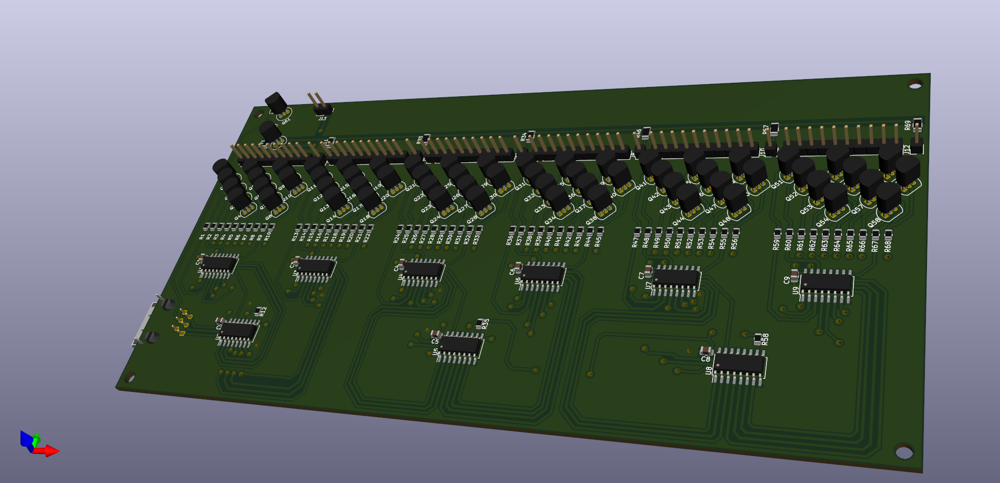
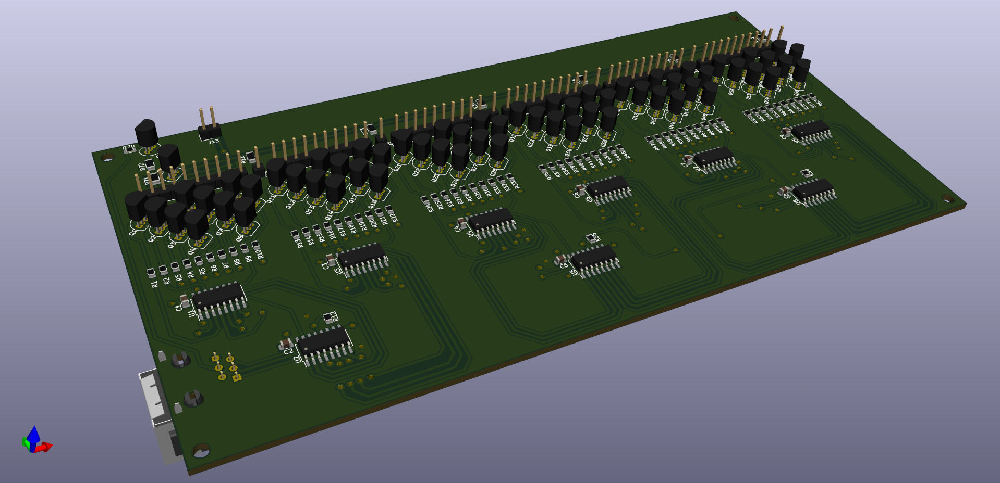
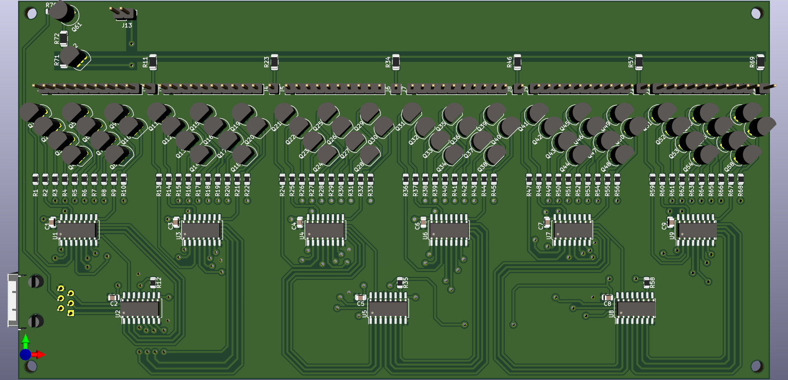
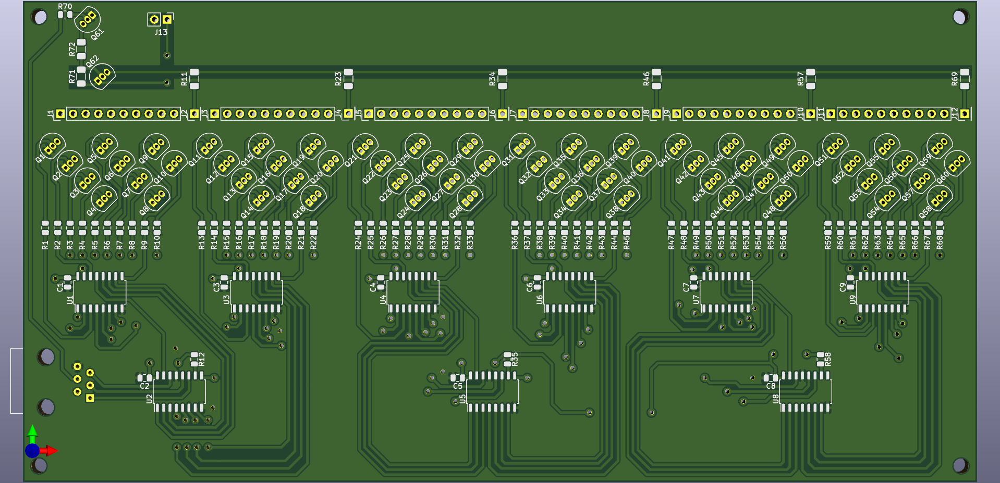
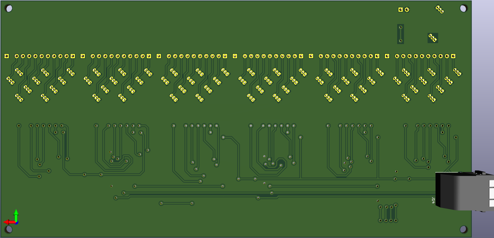
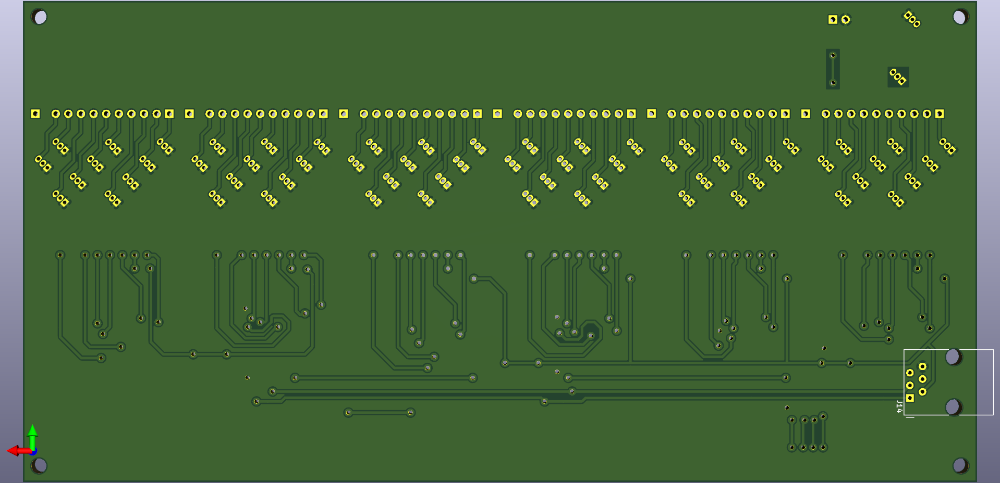

# Moved to Codeberg

This repository was moved to Codeberg:
https://codeberg.org/Kotbenek/Nixie-clock-tubes-driver

# Nixie-clock-tubes-driver
PCB responsible for driving Nixie tubes

## Board overview

- 6P6C connector used for interfacing the [Nixie clock main board](https://github.com/Kotbenek/Nixie-clock-main-board)
- 180V DC input (powered by [180V power supply](https://github.com/Kotbenek/180V-power-supply))
- 6 11-pin connectors for 6 Nixie tubes:
  - 10 cathode pins, statically driving each digit
  - 1 anode pin, with dimming capability (PWM)

## Images

## External 3D models used in the PCB render

- [6P6C connector](https://grabcad.com/library/rj12-1)
